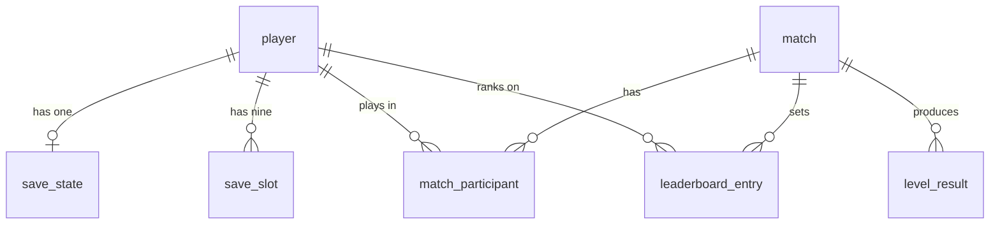

# Database Guide — The Infected Hour

**Engine:** MySQL 8.0 · **Schema:** `infected_hour` · **ORM:** Spring Data JPA (Hibernate)

How the database is set up, what each table holds, how the game reads and writes
it, and the traps that have already caught us once.

---

## 1. Where it lives and who talks to it

The database runs on **one machine only — the host laptop.** It is not
replicated and there is no cloud instance.

```
┌────────────────────┐                    ┌────────────────────┐
│  HOST laptop       │                    │  CLIENT laptop     │
│                    │                    │                    │
│  Game  ──────┐     │                    │  Game              │
│              │     │                    │    │               │
│  Launcher ───┤     │                    │  Launcher          │
│              ▼     │                    │    │               │
│      Spring Boot :8080 ◄────── HTTP ─────────┘               │
│              │     │        (LAN)       │                    │
│              ▼     │                    │                    │
│      MySQL :3306   │                    │                    │
│      infected_hour │                    │                    │
└────────────────────┘                    └────────────────────┘
```

The client learns the backend address during the KryoNet join handshake —
`JoinAccept.backendUrl` carries it, built from the host's real LAN IP. That is
why a save written on the host is visible to the partner: **both launchers call
the same Spring Boot instance.**

### The game does not need the database

Every backend call is asynchronous and failure-tolerant. Solo play and LAN co-op
work with the backend switched off entirely; save slots fall back to
`~/.infectedhour/slots.json` on the local disk. The database is for
**persistence**, not for gameplay. Nothing blocks on HTTP.

---

## 2. Setup

### Configuration

`backend/src/main/resources/application.yml`:

```yaml
spring:
  datasource:
    url: jdbc:mysql://localhost:3306/infected_hour?createDatabaseIfNotExist=true
    username: ${DB_USERNAME:root}
    password: ${DB_PASSWORD:root}
  jpa:
    hibernate:
      ddl-auto: update
```

Two things follow from this:

- **The schema creates itself.** `createDatabaseIfNotExist=true` makes the
  database, and `ddl-auto: update` makes Hibernate build and alter tables from
  the `@Entity` classes. There are no hand-written migration scripts. Add a field
  to an entity, restart, the column appears.
- **The password is never in the code.** `${DB_PASSWORD:root}` reads an
  environment variable and falls back to `root` only if unset. The repository is
  public — a password committed to `application.yml` would be published to the
  world.

### Running it

```bash
$env:DB_PASSWORD = '<your-mysql-password>'
```

```bash
.\gradlew :backend:bootRun
```

> **Port note.** On the current dev laptop, port 8080 is taken by an unrelated
> `AgentService`. Add `$env:SERVER_PORT = '8081'` to move the backend. Remember
> to tell the partner laptop the same port.

### Tests need no MySQL

The test suite runs against **H2 in-memory in MySQL-compatibility mode**, so
`.\gradlew build` works on a machine with no database server installed. This is
convenient but has already hidden one real bug — see §7.

---

## 3. The seven tables



| Table | Rows per player | Purpose |
|---|---|---|
| `player` | 1 | Account and credentials |
| `save_state` | 1 | Permanent progression |
| `save_slot` | up to 9 | Manual saves — restorable points in time |
| `match` | many | One co-op session |
| `match_participant` | 1 per match | That player's stats in that session |
| `level_result` | 1 per level per match | Per-level outcome |
| `leaderboard_entry` | 1 per board | Personal best on each board |

### 3.1 `player`

Username (unique, max 24 chars), display name, **BCrypt password hash**, created
and last-login timestamps. Plaintext passwords are never stored.

### 3.2 `save_state` vs `save_slot` — the distinction that matters

These sound redundant. They are not, and merging them would break the game.

| | `save_state` | `save_slot` |
|---|---|---|
| How many | exactly 1 per player | up to 9 per player |
| Represents | your **account** | a **bookmark** in a run |
| Direction | only ever increases | overwritten and deleted freely |
| Holds | highest level unlocked, story progress, total playtime | checkpoint, HP, contamination, inventory, objectives |

**Why they must stay apart.** Loading slot 3 should rewind your *run* — put you
back at an earlier checkpoint with the HP you had then. It must **not** strip
away the fact that you have already unlocked Level 3. If both lived in one row,
loading an old save would roll back unlocks the player legitimately earned.

So: **loading a slot never touches `save_state`.**

### 3.3 `save_slot` in detail

| Column | Type | Notes |
|---|---|---|
| `id` | BINARY(16) | UUID primary key |
| `player_id` | BINARY(16) | FK → `player` |
| `slot_number` | INT | 1–9. **UNIQUE together with `player_id`** |
| `level_number` | INT | which level |
| `level_name` | VARCHAR(64) | shown on the slot card |
| `checkpoint_id` | VARCHAR(64) | **where to resume** — see §5 |
| `checkpoint_name` | VARCHAR(96) | human label |
| `story_progress` | INT | |
| `playtime_sec` | BIGINT | rendered as "1h 04m" |
| `character_type` | VARCHAR(16) | ELRIC or JANE |
| `player_hp` | FLOAT | ─┐ |
| `personal_contamination_pct` | FLOAT | ─┤ carried resources |
| `global_contamination_pct` | FLOAT | ─┤ |
| `inventory_json` | TEXT | ─┤ |
| `objectives_json` | TEXT | ─┘ |
| `saved_at` | DATETIME(6) | |

The unique constraint on `(player_id, slot_number)` is what makes "save to slot
4" **idempotent**: the write finds the existing row and overwrites it rather than
accumulating duplicates.

**Inventory and objectives are JSON text, not child tables.** This is deliberate.
The data is only ever read and written as a whole, never queried by item, so a
relational breakdown buys nothing — and it would force a schema migration every
time a new item type is added.

### 3.4 Match tables

`match` records one co-op session (host, SOLO/COOP, start, end, result).
`match_participant` records each player's contribution: damage, rescues, samples,
medicine, barricades, sanitations, downs, revives. `level_result` records whether
each level was cleared, how fast, and how many retries.

`leaderboard_entry` is **denormalised on purpose** — it stores the best value per
player per board so the leaderboard screen is a single indexed read instead of an
aggregate across every match ever played. It is upserted when a match completes.

---

## 4. How the code reaches the database

There are **two layers**, and they do different jobs.

### JPA repositories — entity lifecycle

```java
public interface SaveSlotRepository extends JpaRepository<SaveSlot, UUID> {
    Optional<SaveSlot> findByPlayerIdAndSlotNumber(UUID playerId, int slotNumber);
}
```

Spring generates the SQL from the method name. Used inside transactions where
Hibernate should manage the entity's state — dirty checking, cascades, lazy
loading.

### DAOs — explicit SQL

```java
private static final String UPSERT = """
        INSERT INTO save_slot (...) VALUES (...)
        ON DUPLICATE KEY UPDATE
            level_number = VALUES(level_number),
            player_hp    = VALUES(player_hp),
            ...
        """;
```

`SaveSlotDao` and `PlayerStatsDao` write their SQL out in full. Used for two
things JPA does badly:

- **Single-statement writes.** The upsert above is one round trip with no
  read-modify-write race. The JPA path is find-then-save: two statements.
- **Set-based reads.** `PlayerStatsDao` collapses thousands of participant rows
  into a handful of career totals. Doing that through entities would load whole
  object graphs into memory and sum them in Java. A `SUM` belongs in the database.

> **Rule:** never use both layers for the same operation. Pick one per use case.

---

## 5. The save/load flow

This is where the checkpoint system and the database meet.

### The 22 checkpoints

`shared/level/CheckpointRegistry` defines 22 named checkpoints, split **7 / 8 / 7**
across the three levels. Each has an id, display name, level, order, and spawn
tile.

`shared`, not `core`, because three modules need them without depending on
libGDX: the game spawns players there, the launcher prints the name on a slot
card, and the backend can validate an incoming id.

### Saving

```
player walks within 1.5 tiles of a checkpoint
        │
        ▼
CheckpointSystem records it  ──►  EVENT_CHECKPOINT_REACHED broadcast
        │
        ▼
GameServer.captureSave(slotNumber)
        │  builds a SaveSlotDto from the AUTHORITATIVE world
        ▼
PUT /api/v1/players/me/slots/{n}
        │
        ├──► MySQL  save_slot  (upsert)
        └──► ~/.infectedhour/slots.json  (local mirror)
```

**Only the host may save.** It owns the only authoritative copy of the world, so
a save taken there is guaranteed consistent. A client's view is ~100 ms stale by
design (snapshot interpolation) and omits anything outside its snapshot.

### Loading

```
Load Game screen  ──►  GET /api/v1/players/me/slots   (all 9, empty included)
        │                    └── on failure: read slots.json instead
        ▼
player picks slot 4
        │
        ▼
SessionState.loadedSlot ──► SessionConfig.hostingFromSave(...)
        │
        ▼
GameServer.restoreFrom(slot)      ← BEFORE the first simulation tick
        │
        ├── look up checkpoint_id in CheckpointRegistry
        ├── place players at its spawn tile
        ├── restore HP + personal contamination
        └── restore the global contamination meter
```

Restore happens **before the first tick** so the first snapshot clients receive
already reflects the loaded world. Nobody ever sees the pre-load state flash on
screen.

### Why slots store an id, never coordinates

`save_slot.checkpoint_id` holds `"l2_cp03_clinic"`, and the spawn position is
looked up from the registry at load time.

Storing `x/y` in the row instead would freeze them: moving a checkpoint during
development would silently strand every old save inside a wall. The id is a
permanent contract — **renaming a checkpoint id invalidates every save that
references it.** Add new ones at the end of a level's block; never renumber.

An unknown id (from a rename that slipped through) falls back to the level's
first checkpoint rather than refusing to load.

---

## 6. Offline behaviour

Save slots are mirrored to `~/.infectedhour/slots.json`.

**The backend is the truth when reachable.** A successful `GET /slots` overwrites
the local file. The local file is read only when the call fails or the player is
in offline mode.

`LocalSaveSlots` degrades quietly by design: a corrupt or hand-edited file yields
nine empty slots rather than an exception, because a broken save file must never
stop the player reaching the menu.

---

## 7. Traps we have already hit

### 7.1 MySQL reserved words

`MATCH` and `CHARACTER` are **reserved in MySQL 8**. Unquoted DDL fails outright:

```
You have an error in your SQL syntax ... near 'match ('
```

Both are now backtick-quoted in the entity mappings:

```java
@Table(name = "`match`")
@Column(name = "`character`", nullable = false, length = 8)
```

Quoting rather than renaming keeps the names matching this documentation.

**The tests did not catch this.** H2's MySQL-compatibility mode is more permissive
about reserved identifiers than real MySQL, so the whole suite passed while the
real database refused to start. Anything touching DDL should be smoke-tested
against actual MySQL at least once.

Any hand-written SQL referencing these must quote them too:

```sql
SELECT mp.`character` FROM match_participant mp JOIN `match` m ON m.id = mp.match_id;
```

### 7.2 UUIDs are BINARY(16), not strings

Hibernate stores `UUID` as 16 raw bytes, **not** a 36-character string. A JDBC
parameter bound as text silently matches nothing — no error, just zero rows.
`SaveSlotDao.toBytes(UUID)` converts explicitly, and every DAO query uses it.

In the MySQL client, convert with `UNHEX(REPLACE(UUID(),'-',''))`.

### 7.3 Column lengths

`player.username` is `VARCHAR(24)`. A test that generated usernames with a full
UUID suffix (48 chars) failed with an opaque `DataIntegrityViolationException`
long before any business logic ran.

---

## 8. Inspecting the database

### MySQL Workbench

Open Workbench → your local connection → click the **Schemas** tab at the bottom
of the Navigator (not *Administration*) → expand `infected_hour` → **Tables** →
right-click → *Select Rows*.

### Command line

```bash
& "C:\Program Files\MySQL\MySQL Server 8.0\bin\mysql.exe" -u root -p -D infected_hour
```

Useful queries:

```sql
SHOW TABLES;
```

```sql
DESCRIBE save_slot;
```

```sql
SELECT slot_number, level_name, checkpoint_name, player_hp, saved_at
  FROM save_slot ORDER BY slot_number;
```

```sql
SELECT p.display_name, s.highest_level_unlocked, s.total_playtime_sec
  FROM save_state s JOIN player p ON p.id = s.player_id;
```

---

## 9. Troubleshooting

| Symptom | Cause | Fix |
|---|---|---|
| `Access denied for user 'root'@'localhost'` | wrong or unset password | set `$env:DB_PASSWORD` before `bootRun` |
| `Port 8080 was already in use` | another app holds it | `$env:SERVER_PORT = '8081'` |
| `error in your SQL syntax near 'match ('` | reserved word unquoted | backtick it — §7.1 |
| Query returns 0 rows for a UUID that exists | UUID bound as text | use `toBytes()` / `UNHEX` — §7.2 |
| `Communications link failure` | MySQL service stopped | start the `MySQL80` service |
| Tables empty after playing | no account registered | register through the launcher's Login → Register |
| Client laptop's saves do not appear | pointed at its own backend | it must use the host's URL from `JoinAccept` |

---

## 10. Current state

Schema created, all seven tables present. The save-slot API, DAO layer, Load Game
screen and the 22-checkpoint system are complete and tested (50 tests).

**Not yet wired:** no key press in `GameScreen` triggers `captureSave()` and the
subsequent `PUT`. The storage and restore paths are finished and tested — the
remaining work is the in-game save prompt and slot picker.
